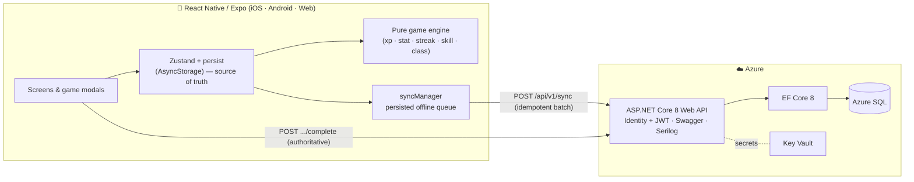

<div align="center">

# ⚔️ Life RPG

**Turn real-life habits into an RPG.** Create a hero, complete quests across six stats, earn XP, level up, unlock skills, and evolve your class through five tiers.

A full-stack project: a **React Native / Expo** mobile + web client backed by an **ASP.NET Core (.NET 8) + EF Core + SQL Server** API on **Azure**, with an offline-first sync layer.

[](https://github.com/sofia-muse/life-rpg/actions/workflows/ci.yml)


<!-- TODO: replace with the hero GIF of the level-up cascade -->
<!--  -->

**🔗 Live demo:** _coming soon (Vercel)_ · **📱 Android APK:** _coming soon (EAS)_

</div>

---

## Highlights

- 🎮 **Complete RPG progression** — 6 stats, an XP curve (`100 × level^1.5`, max level 100), 24 unlockable skills (single-stat + cross-stat), and 30 class titles across 5 tiers.
- 🧠 **Personality-quiz onboarding** that seeds your starting focus stats and quests.
- 🔥 **Streaks & daily rewards** with 8 milestone multipliers (up to 3×).
- 🛡️ **Server-authoritative game logic** — XP, levels, class and skill unlocks are recomputed on the server (anti-cheat); the client computes the same values optimistically for instant, animated feedback.
- 📴 **Offline-first** — local state is the source of truth; a persisted queue flushes to an **idempotent batch-sync** endpoint when back online.
- ✅ **113 automated tests** (55 backend, 58 frontend) with the game engine ported identically to C# and TypeScript, proven equal by golden-value tests.

## Architecture



**Layers (backend):** Clean architecture — `Api → Application → Domain`, `Infrastructure → Application/Domain`, enforced by an architecture test. The `Domain` game engine is a faithful C# port of the client's TypeScript engine, so client and server always agree on progression.

## Tech stack

| Area | Technologies |
|------|-------------|
| **Frontend** | React Native, Expo (Router, typed routes), TypeScript (strict), Zustand + persist, Reanimated, Lottie, react-native-svg |
| **Backend** | C#, ASP.NET Core 8 (Web API), EF Core 8 (Code-First + migrations), ASP.NET Identity + JWT, FluentValidation-style validation, Serilog, Swagger/OpenAPI, rate limiting, health checks |
| **Database** | SQL Server / Azure SQL (JSON columns, rowversion concurrency, unique indexes) |
| **Cloud / DevOps** | Azure App Service, Azure SQL, Key Vault, Application Insights, Bicep (IaC), Azure DevOps pipeline, GitHub Actions CI |
| **Testing** | xUnit + FluentAssertions + WebApplicationFactory (backend) · Jest + jest-expo (frontend) |

## Project layout

```
life-rpg/
├── app/                 # Expo Router screens (tabs, onboarding, auth, modals)
├── src/
│   ├── engine/          # pure game logic (XP, stats, streaks, skills, classes)
│   ├── store/           # Zustand stores (hero, quest, skill, journal, auth, ui)
│   ├── api/             # typed API client, auth, offline sync queue
│   └── config/          # static game data (xp tables, skills, classes, theme)
└── backend/             # ASP.NET Core solution
    ├── src/             # Api · Application · Domain · Infrastructure
    ├── tests/           # unit + integration tests
    └── infra/           # Bicep (Azure resources)
```

## Run it locally

### Frontend (Expo)
```bash
npm install --legacy-peer-deps
cp .env.example .env        # defaults to demo mode (no backend needed)
npm start                   # press w (web), a (Android), i (iOS)
```
By default the app runs in **demo mode** (fully local). Point it at the API by setting `EXPO_PUBLIC_API_URL` and `EXPO_PUBLIC_DEMO_MODE=false` in `.env`.

### Backend (.NET API)
```bash
cd backend
dotnet run --project src/LifeRpg.Api      # Swagger at http://localhost:5005/swagger
```
Runs against a local SQLite database out of the box; configured for SQL Server / Azure SQL in production.

## Testing
```bash
npm run typecheck && npm run lint && npm run test:coverage   # frontend
cd backend && dotnet test                                    # backend
```
- **Frontend:** 58 engine tests, ~92% engine coverage (gated at 80%).
- **Backend:** 55 tests — domain golden-value tests + WebApplicationFactory integration tests (auth, full quest flow, anti-cheat, sync idempotency).

## Design decisions
- **Offline-first, server-validated.** The client applies XP optimistically for snappy UX; the server recomputes from the same engine and is the source of truth. Shared constants keep them identical (verified by tests).
- **Idempotent sync.** Each queued operation carries a stable `opId` logged server-side, so replaying a batch after a flaky connection is a no-op.
- **Secrets via Key Vault.** No connection strings or signing keys in the repo; the App Service reads them through Key Vault references using a managed identity.

## License
MIT — see [LICENSE](LICENSE).
